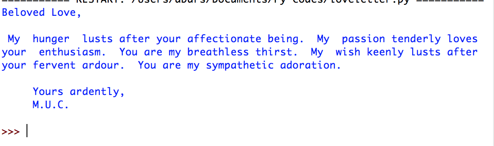

# loveletter
A Python implementation of Christopher Strachey's "Loveletters" program (1952) 

Port from original PHP found at [gingerbeardman/loveletter](https://github.com/gingerbeardman/loveletter) which is hosted [here](http://www.gingerbeardman.com/loveletter/) for interactive Letter Generation 

### Sample Letter:

